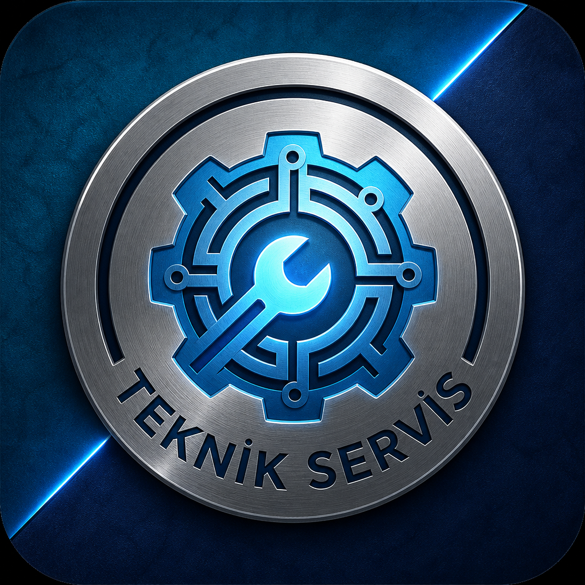

<div align="center">



# Teknik Servis Takip Sistemi

**Çok dükkanlı (multi-tenant) teknik servis yönetim platformu**

Tamir kayıtlarından stok ve kasaya, müşteri takibinden termal fişe — servis operasyonunu tek panelden yönetin.

[](https://nextjs.org/)
[](https://www.typescriptlang.org/)
[](https://supabase.com/)
[](https://vercel.com/)
[](https://web.dev/progressive-web-apps/)
[](#lisans)

[Özellikler](#-öne-çıkan-özellikler) · [Galeri](#-galeri) · [Hızlı Başlama](#-hızlı-başlama) · [Roller](#-kullanıcı-rolleri) · [Mimari](#-teknoloji-yığını--mimari)

</div>

---

## ✨ Öne çıkan özellikler

- 🏢 **Çok dükkanlı (multi-tenant)** — Her işletme `tenant_id` ile izole; takip kodları dükkan önekli (ör. `BPH-26-001`)
- 🔍 **Müşteri takip** — Takip kodu veya QR ile cihaz durumu, parçalar ve isteğe bağlı ücret
- 🧾 **Termal fiş & QR** — 80 mm fiş; QR müşteri sorgulama sayfasına yönlendirir
- 🛒 **Hızlı satış (POS)** — Stoktan nakit / kart / veresiye; veresiye → cari borç
- 📦 **Stok & tedarikçi** — Stok artışında `adet × maliyet` otomatik tedarikçi borcu
- 💰 **Kasa, cari & finans** — Gelir–gider, müşteri bakiyeleri, tedarikçi cari
- 🌐 **Çoklu dil** — TR · EN · ES · IT · RU
- 📱 **PWA** — Müşteri ve yönetim için ayrı ana ekran kısayolları
- 🔐 **Rol tabanlı erişim** — Geliştirici, admin, teknisyen, kasa

---

## 🖼️ Galeri

> Aşağıdaki yer tutucuları gerçek ekran görüntüleriyle değiştirin (`docs/screenshots/` önerilir).

| Müşteri Takibi | Yönetim Paneli (Dashboard) |
|:---:|:---:|
|  |  |
| *Takip kodu ile durum sorgusu* | *Aktif kayıtlar, filtre ve arama* |

| Hızlı Satış (POS) | Termal Fiş |
|:---:|:---:|
|  |  |
| *Sepet, ödeme ve veresiye* | *80 mm fiş + QR* |

---

## 🚀 Hızlı başlama

### 1. Klonlama

```bash
git clone https://github.com/bcnaydin75/teknik_servis.git
cd teknik_servis
```

### 2. Bağımlılıklar

```bash
npm install
```

> **Node.js ≥ 20** gerekir (`package.json` → `engines`).

### 3. Ortam değişkenleri

```bash
cp .env.example .env.local
```

`.env.local` içinde doldurun (referans: `.env.example`):

| Değişken | Zorunlu | Açıklama |
|----------|:-------:|----------|
| `SUPABASE_URL` | Evet | Supabase proje URL |
| `SUPABASE_SERVICE_ROLE_KEY` | Evet | Sunucu tarafı anahtar (gizli) |
| `SESSION_SECRET` | Evet | Oturum JWT imzalama |
| `SUPABASE_STORAGE_BUCKET` | Hayır | Logo bucket (varsayılan `logos`) |
| `NEXT_PUBLIC_APP_URL` | Hayır | Takip / QR link kökü |
| `NEXT_PUBLIC_TENANT_SLUG` | Hayır | Public ayarlar için **dükkan admin** kullanıcı adı (geliştirici değil) |
| `RESEND_API_KEY` | Hayır* | Şifre sıfırlama e-postası ([Resend](https://resend.com)) |
| `EMAIL_FROM` | Hayır | Gönderen adresi (ör. `Teknik Servis <onboarding@resend.dev>`) |

\* Production’da unuttum-şifrem için gerekli.

### 4. Veritabanı (migration)

Supabase SQL Editor’da `supabase/migrations/` dosyalarını **sırayla** çalıştırın:

```text
001_initial_schema.sql
002_superadmin_multi_shop.sql
003_shop_tracking_prefix.sql
004_turkce_tablo_adlari.sql
```

> Yeni kurulumda `001` → `004` sırayla. Mevcut İngilizce tablolar için `004_turkce_tablo_adlari.sql` rename yapar.

### 5. Çalıştırma

```bash
npm run dev
```

Uygulama: [http://localhost:3000](http://localhost:3000) · Yönetim: [http://localhost:3000/admin/login](http://localhost:3000/admin/login)

### 6. Üretim

```bash
npm run build
```

Vercel’de `main` branch deploy; ortam değişkenlerini Vercel → **Settings → Environment Variables** altına ekleyin.

### PWA ikonları (isteğe bağlı)

Kaynak: `public/brand-logo.png`

```bash
node scripts/make-pwa-icons.mjs
```

Çıktı: `public/icons/*`, `apple-touch-icon.png`, `favicon.png`, `src/app/icon.png`.  
Ana ekran kısayolu değişince eski kısayolu silip yeniden ekleyin (cache).

---

## 👥 Kullanıcı rolleri

| Rol | Kim | Yetki |
|:----|:----|:------|
| **Geliştirici** | Platform sahibi (`is_superadmin`) | Tüm dükkanlar, dükkan yöneticisi oluşturma |
| **Admin** | Dükkan sahibi / yetkili personel | Tam dükkan yönetimi (ayar, personel, stok, tamir…) |
| **Teknisyen** | Personel | Tamir işlemleri — maliyet görmez |
| **Kasa** | Personel | POS, finans, cari |

```text
Takip kodu formatı →  {ÖNEK}-{YY}-{SIRA}   örn. BPH-26-001
```

---

## 🧩 Modüller

### Müşteri sayfası (`/`)

- Üst rozet: **Teknik Servis Takip Sistemi**
- Sorgu: `/?takip_kodu=…` veya `?kod=…`
- Ücret detayı dükkan ayarına göre tamamen gizlenebilir
- PWA: `public/manifest.webmanifest` → `start_url: "/"`

### Yönetim paneli (`/admin`)

Giriş: `/admin/login` — oturum çerezi + middleware.

| Bölüm | İşlev |
|-------|--------|
| **Panel** | Aktif kayıtlar, filtre, arama, cihaz ekle/düzenle, WhatsApp, fiş, garanti |
| **Arşiv** | Geri yükle / kalıcı sil |
| **Hızlı satış (POS)** | Stoktan satış; nakit, kart, veresiye → cari |
| **Stok** | Parça, maliyet, satış, adet, tedarikçi; artışta otomatik borç |
| **Tedarikçiler** | Kart, borç / ödeme, kalan bakiye |
| **Kasa / Finans** | Gelir–gider özeti ve hareketler |
| **Cari** | Müşteri bakiyeleri |
| **Ayarlar** | Firma profili, takip öneki, ücret görünürlüğü, personel, dil, tema, şifre |
| **Fiş** | `/admin/receipt/[kod]` — firma, cihaz, takip kodu, QR |

Yönetim PWA: `public/admin-manifest.webmanifest` → `/admin`

---

## 🗄️ Veri modeli

Şema: `supabase/migrations/`

| Tablo | İçerik |
|-------|--------|
| `yonetici_kullanicilar` | Kullanıcılar, roller, tenant |
| `dukkan_ayarlari` | Firma profili, logo, ücret gösterimi, takip öneki |
| `musteriler` | Müşteriler ve cari risk |
| `tamir_kayitlari` | Tamir kayıtları / takip kodu |
| `stok` | Envanter |
| `tedarikciler` / `tedarikci_islemleri` | Tedarikçi cari |
| `finans_islemleri` | Kasa hareketleri |
| `garantiler` | Parça garantileri |
| `pos_satislar` / `pos_satis_kalemleri` | POS satışları |
| `cari_islemleri` | Müşteri cari |

---

## 🛠️ Teknoloji yığını & mimari

| Katman | Teknoloji |
|--------|-----------|
| Frontend | Next.js 16 (App Router), React 19, TypeScript, Tailwind CSS 4 |
| API | Next.js Route Handlers (`/api/*`) |
| Veritabanı | Supabase PostgreSQL + Storage |
| Auth | JWT oturum çerezi (`jose`) |
| E-posta | Resend (şifre sıfırlama OTP) |
| Deploy | Vercel |

```text
┌─────────────┐
│  Tarayıcı   │  Web / PWA
│  (Client)   │
└──────┬──────┘
       │
       ▼
┌──────────────────────────────┐
│     Next.js on Vercel        │
│  ┌────────┐   ┌───────────┐  │
│  │   UI   │   │  /api/*   │  │
│  │ pages  │   │ handlers  │  │
│  └────────┘   └─────┬─────┘  │
└─────────────────────┼────────┘
                      │
                      ▼
            ┌──────────────────┐
            │     Supabase     │
            │  PostgreSQL      │
            │  + Storage       │
            └──────────────────┘
```

| Yol | Rol |
|-----|-----|
| `src/app/api/[...path]/route.ts` | API giriş noktası |
| `src/lib/server/native-api.ts` | Endpoint → handler eşlemesi |
| `src/lib/server/db-tables.ts` | Türkçe tablo adları |
| `src/lib/server/tenant-context.ts` | Dükkan / superadmin kapsamı |
| `supabase/migrations/` | Şema |

---

## 🔄 Tipik iş akışı

1. Geliştirici → dükkan admini oluşturur.
2. Admin → firma profili, takip öneki, logo.
3. Stok + tedarikçi (borç otomatik).
4. Cihaz kaydı → takip kodu, fiş / WhatsApp.
5. Müşteri kod veya QR ile durumu görür.
6. Teslim → isteğe bağlı garanti; parça satışı POS üzerinden.

---

## 🤝 Katkı sağlama

Katkılar memnuniyetle karşılanır.

1. Bu repo’yu fork’layın
2. Özellik dalı açın (`git checkout -b feature/amazing-feature`)
3. Değişiklikleri commit’leyin (`git commit -m "Add amazing feature"`)
4. Dalı push’layın (`git push origin feature/amazing-feature`)
5. Pull Request açın

> Production sırları (`SUPABASE_SERVICE_ROLE_KEY`, `SESSION_SECRET`, `RESEND_API_KEY`) **asla** commit edilmemelidir. `.env.local` `.gitignore` altındadır.

---

## 📄 Lisans

Özel / kapalı kaynak proje. Tüm hakları saklıdır. İzinsiz kopyalama, dağıtım veya ticari kullanım yasaktır.

---

<div align="center">

**Teknik Servis Takip Sistemi** · [GitHub](https://github.com/bcnaydin75/teknik_servis)

</div>
